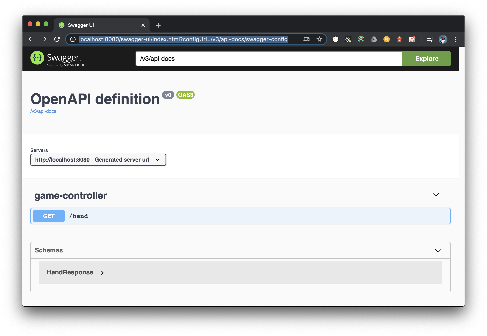

# Rock Paper Scissors Game - Random Response

A simple [Rock Paper Scissors game](https://en.wikipedia.org/wiki/Rock_paper_scissors) build on Spring Boot as REST service.  This is a very primitive implementation of the Rock Paper Scissors game.  It simply returns a random hand between rock, paper or scissors when queried through the single endpoint.

The project is created in a TDD fashion.

## Technology stack

1. Java 14
1. Gradle (single project)
1. Docker
1. Spring
    1. Spring framework (dependency injection)
    1. Spring Boot
    1. Spring Web (not reactive) and REST
1. OpenApi (Swagger)
1. Lombok
1. Mockito

## Create project

1. Access [Spring initializr https://start.spring.io/](https://start.spring.io/)

    

    | Option      | Selection      |
    |-------------|----------------|
    | Project     | Gradle Project |
    | Language    | Java           |
    | Spring Boot | 2.3.0          |

    **Project Metadata**

    | Option       | Selection                |
    |--------------|--------------------------|
    | Group        | demo                     |
    | Artifact     | rock-paper-scissors      |
    | Name         | rock-paper-scissors      |
    | Description  | Rock Paper Scissors Game |
    | Package name | demo.games               |
    | Packaging    | jar                      |
    | Java         | 14                       |

    **Dependencies**

    | Dependencies |
    |--------------|
    | Lombok       |
    | Spring Web   |

    Click *Generate* to download the zip file

## Configure the project

1. Extract the downloaded zip file

    ```bash
    $ unzip rock-paper-scissors.zip

    Archive:  rock-paper-scissors.zip
       creating: rock-paper-scissors/
      inflating: rock-paper-scissors/settings.gradle
       creating: rock-paper-scissors/gradle/
       creating: rock-paper-scissors/gradle/wrapper/
      inflating: rock-paper-scissors/gradle/wrapper/gradle-wrapper.jar
      inflating: rock-paper-scissors/gradle/wrapper/gradle-wrapper.properties
      inflating: rock-paper-scissors/gradlew.bat
      inflating: rock-paper-scissors/gradlew
      inflating: rock-paper-scissors/build.gradle
       creating: rock-paper-scissors/src/
       creating: rock-paper-scissors/src/main/
       creating: rock-paper-scissors/src/main/java/
       creating: rock-paper-scissors/src/main/java/demo/
       creating: rock-paper-scissors/src/main/java/demo/games/
      inflating: rock-paper-scissors/src/main/java/demo/games/RockPaperScissorsApplication.java
       creating: rock-paper-scissors/src/main/resources/
      inflating: rock-paper-scissors/src/main/resources/application.properties
       creating: rock-paper-scissors/src/main/resources/templates/
       creating: rock-paper-scissors/src/main/resources/static/
       creating: rock-paper-scissors/src/test/
       creating: rock-paper-scissors/src/test/java/
       creating: rock-paper-scissors/src/test/java/demo/
       creating: rock-paper-scissors/src/test/java/demo/games/
      inflating: rock-paper-scissors/src/test/java/demo/games/RockPaperScissorsApplicationTests.java
      inflating: rock-paper-scissors/HELP.md
      inflating: rock-paper-scissors/.gitignore
    ```

    The directory structure of the project

    ```bash
    $ tree rock-paper-scissors
    rock-paper-scissors
    ├── HELP.md
    ├── build.gradle
    ├── gradle
    │   └── wrapper
    │       ├── gradle-wrapper.jar
    │       └── gradle-wrapper.properties
    ├── gradlew
    ├── gradlew.bat
    ├── settings.gradle
    └── src
        ├── main
        │   ├── java
        │   │   └── demo
        │   │       └── games
        │   │           └── RockPaperScissorsApplication.java
        │   └── resources
        │       ├── application.properties
        │       ├── static
        │       └── templates
        └── test
            └── java
                └── demo
                    └── games
                        └── RockPaperScissorsApplicationTests.java

    14 directories, 10 files
    ```

1. Navigate in the project's directory

    ```bash
    $ cd rock-paper-scissors
    ```

    All commands are executed from within the project directory.

1. Delete the unnecessary files and folders

    ```bash
    $ rm -rf src/main/resources/templates/
    $ rm -rf src/main/resources/static/
    $ rm HELP.md
    ```

1. (*Optional*) Change the empty file's `src/main/resources/application.properties` extension to `yaml` (or `yml`), `src/main/resources/application.yaml`

    ```bash
    $ mv src/main/resources/application.properties src/main/resources/application.yaml
    ```

    This is a matter of preference as the application can be configured either using `.properties` or `.yaml`.

1. Open the project in the IDE

    ```bash
    $ idea .
    ```

1. Rename the two source files to use a shorter name, such as `GameXyz.java`, using the IDE refactoring tools

    Rename the class `RockPaperScissorsApplication` (file: `src/main/java/demo/games/RockPaperScissorsApplication.java`) to `GameApplication`

    

    Rename the class `RockPaperScissorsApplicationTests` (file: `src/main/java/demo/games/RockPaperScissorsApplication.java`) to `GameApplicationTests`.

    

1. Update file: `build.gradle`

    ```groovy
    plugins {
      id 'java'

      id 'org.springframework.boot' version '2.3.0.RELEASE'
      id 'io.spring.dependency-management' version '1.0.9.RELEASE'
    }

    java {
      sourceCompatibility = JavaVersion.VERSION_14
      targetCompatibility = JavaVersion.VERSION_14
    }

    repositories {
      mavenCentral()
      jcenter()
    }

    configurations {
      compileOnly {
        extendsFrom annotationProcessor
      }
    }

    dependencies {
      /* Lombok */
      compileOnly 'org.projectlombok:lombok'
      annotationProcessor 'org.projectlombok:lombok'

      /* Spring */
      implementation 'org.springframework.boot:spring-boot-starter-web'
      testImplementation('org.springframework.boot:spring-boot-starter-test') {
        exclude group: 'org.junit.vintage', module: 'junit-vintage-engine'
      }
    }

    test {
      useJUnitPlatform()
      testLogging {
        events = ['FAILED', 'PASSED', 'SKIPPED', 'STANDARD_OUT']
      }
    }
    ```

1. Build the application

    ```bash
    $ ./gradlew clean build

    ...
    BUILD SUCCESSFUL in 4s
    6 actionable tasks: 5 executed, 1 up-to-date
    ```

    Should build without errors

## Run the application

1. Run the application using the Spring boot Gradle task `bootRun`

    ```bash
    $ ./gradlew bootRun
    ```

    This should start the application

    ```bash
    > Task :bootRun

      .   ____          _            __ _ _
     /\\ / ___'_ __ _ _(_)_ __  __ _ \ \ \ \
    ( ( )\___ | '_ | '_| | '_ \/ _` | \ \ \ \
     \\/  ___)| |_)| | | | | || (_| |  ) ) ) )
      '  |____| .__|_| |_|_| |_\__, | / / / /
     =========|_|==============|___/=/_/_/_/
     :: Spring Boot ::        (v2.3.0.RELEASE)

    2020-04-27 12:34:55.768  INFO 5554 --- [           main] demo.games.GameApplication               : Starting GameApplication on Alberts-MBP.fritz.box with PID 5554 (build/classes/java/main started by albertattard in .)
    2020-04-27 12:34:55.771  INFO 5554 --- [           main] demo.games.GameApplication               : No active profile set, falling back to default profiles: default
    2020-04-27 12:34:56.545  INFO 5554 --- [           main] o.s.b.w.embedded.tomcat.TomcatWebServer  : Tomcat initialized with port(s): 8080 (http)
    2020-04-27 12:34:56.556  INFO 5554 --- [           main] o.apache.catalina.core.StandardService   : Starting service [Tomcat]
    2020-04-27 12:34:56.556  INFO 5554 --- [           main] org.apache.catalina.core.StandardEngine  : Starting Servlet engine: [Apache Tomcat/9.0.35]
    2020-04-27 12:34:56.629  INFO 5554 --- [           main] o.a.c.c.C.[Tomcat].[localhost].[/]       : Initializing Spring embedded WebApplicationContext
    2020-04-27 12:34:56.629  INFO 5554 --- [           main] o.s.web.context.ContextLoader            : Root WebApplicationContext: initialization completed in 819 ms
    2020-04-27 12:34:56.752  INFO 5554 --- [           main] o.s.s.concurrent.ThreadPoolTaskExecutor  : Initializing ExecutorService 'applicationTaskExecutor'
    2020-04-27 12:34:56.890  INFO 5554 --- [           main] o.s.b.w.embedded.tomcat.TomcatWebServer  : Tomcat started on port(s): 8080 (http) with context path ''
    2020-04-27 12:34:56.898  INFO 5554 --- [           main] demo.games.GameApplication               : Started GameApplication in 1.508 seconds (JVM running for 1.838)
    <=========----> 75% EXECUTING [1m 23s]
    > :bootRun
    ```

    Use `[control] + [c]` to stop the application

1. Run the application using Java directly

    ```bash
    $ java -jar build/libs/rock-paper-scissors.jar
    ```

    This will start the application

    ```bash

      .   ____          _            __ _ _
     /\\ / ___'_ __ _ _(_)_ __  __ _ \ \ \ \
    ( ( )\___ | '_ | '_| | '_ \/ _` | \ \ \ \
     \\/  ___)| |_)| | | | | || (_| |  ) ) ) )
      '  |____| .__|_| |_|_| |_\__, | / / / /
     =========|_|==============|___/=/_/_/_/
     :: Spring Boot ::        (v2.3.0.RELEASE)

    2020-04-27 12:34:55.072  INFO 5566 --- [           main] demo.games.GameApplication               : Starting GameApplication on Alberts-MBP.fritz.box with PID 5566 (build/libs/rock-paper-scissors.jar started by albertattard in .)
    2020-04-27 12:34:55.075  INFO 5566 --- [           main] demo.games.GameApplication               : No active profile set, falling back to default profiles: default
    2020-04-27 12:34:56.188  INFO 5566 --- [           main] o.s.b.w.embedded.tomcat.TomcatWebServer  : Tomcat initialized with port(s): 8080 (http)
    2020-04-27 12:34:56.204  INFO 5566 --- [           main] o.apache.catalina.core.StandardService   : Starting service [Tomcat]
    2020-04-27 12:34:56.204  INFO 5566 --- [           main] org.apache.catalina.core.StandardEngine  : Starting Servlet engine: [Apache Tomcat/9.0.35]
    2020-04-27 12:34:56.292  INFO 5566 --- [           main] o.a.c.c.C.[Tomcat].[localhost].[/]       : Initializing Spring embedded WebApplicationContext
    2020-04-27 12:34:56.293  INFO 5566 --- [           main] o.s.web.context.ContextLoader            : Root WebApplicationContext: initialization completed in 1143 ms
    2020-04-27 12:34:56.468  INFO 5566 --- [           main] o.s.s.concurrent.ThreadPoolTaskExecutor  : Initializing ExecutorService 'applicationTaskExecutor'
    2020-04-27 12:34:56.657  INFO 5566 --- [           main] o.s.b.w.embedded.tomcat.TomcatWebServer  : Tomcat started on port(s): 8080 (http) with context path ''
    2020-04-27 12:34:56.667  INFO 5566 --- [           main] demo.games.GameApplication               : Started GameApplication in 2.088 seconds (JVM running for 2.606)
    ```

    Use `[control] + [c]` to stop the application

## (Optional) Change the ASCII art (the `banner.txt` file)

1. Create a banner ([Ascii Art](http://patorjk.com/software/taag/#p=display&f=Big&t=rock%20paper%20scissors))

    Create file: `src/main/resources/banner.txt`

    ```
                     _                                             _
                    | |                                           (_)
      _ __ ___   ___| | __  _ __   __ _ _ __   ___ _ __   ___  ___ _ ___ ___  ___  _ __ ___
     | '__/ _ \ / __| |/ / | '_ \ / _` | '_ \ / _ \ '__| / __|/ __| / __/ __|/ _ \| '__/ __|
     | | | (_) | (__|   <  | |_) | (_| | |_) |  __/ |    \__ \ (__| \__ \__ \ (_) | |  \__ \
     |_|  \___/ \___|_|\_\ | .__/ \__,_| .__/ \___|_|    |___/\___|_|___/___/\___/|_|  |___/
                           | |         | |
                           |_|         |_|

    ```

    Any text will do here.

    Running the application will now show the new banner

    ```bash
    $ ./gradlew bootRun

    > Task :bootRun
                     _                                             _
                    | |                                           (_)
      _ __ ___   ___| | __  _ __   __ _ _ __   ___ _ __   ___  ___ _ ___ ___  ___  _ __ ___
     | '__/ _ \ / __| |/ / | '_ \ / _` | '_ \ / _ \ '__| / __|/ __| / __/ __|/ _ \| '__/ __|
     | | | (_) | (__|   <  | |_) | (_| | |_) |  __/ |    \__ \ (__| \__ \__ \ (_) | |  \__ \
     |_|  \___/ \___|_|\_\ | .__/ \__,_| .__/ \___|_|    |___/\___|_|___/___/\___/|_|  |___/
                          | |         | |
                          |_|         |_|
    ...
    ```

    Use `[control] + [c]` to stop the application

## Return a random hand

1. Project structure

    Clean the project to remove any artefacts produced by the build task before.

    ```bash
    $ ./gradlew clean
    ```

    The project structure should look like the following (easier to compare without the *build* folder)

    ```bash
    $ tree .
    .
    ├── build.gradle
    ├── gradle
    │   └── wrapper
    │       ├── gradle-wrapper.jar
    │       └── gradle-wrapper.properties
    ├── gradlew
    ├── gradlew.bat
    ├── settings.gradle
    └── src
        ├── main
        │   ├── java
        │   │   └── demo
        │   │       └── games
        │   │           └── GameApplication.java
        │   └── resources
        │       ├── application.yaml
        │       └── banner.txt
        └── test
            └── java
                └── demo
                    └── games
                        └── GameApplicationTests.java

    12 directories, 10 files
    ```

1. Update the application tests

    Our application should accept a `GET` request to `/hand` and respond

    ```json
    {"hand":"ROCK"}
    ```

    The hand value should be random.

    Update the file `src/test/java/demo/games/GameApplicationTests.java` from

    ```java
    package demo.games;

    import org.junit.jupiter.api.Test;
    import org.springframework.boot.test.context.SpringBootTest;

    @SpringBootTest
    class GameApplicationTests {

    	@Test
    	void contextLoads() {
    	}
    }
    ```

    to

    ```java
    package demo.games;

    import org.junit.jupiter.api.DisplayName;
    import org.junit.jupiter.api.Test;
    import org.springframework.beans.factory.annotation.Autowired;
    import org.springframework.boot.test.context.SpringBootTest;
    import org.springframework.boot.test.web.client.TestRestTemplate;
    import org.springframework.boot.web.server.LocalServerPort;

    import java.util.List;

    import static org.assertj.core.api.Assertions.assertThat;
    import static org.springframework.boot.test.context.SpringBootTest.WebEnvironment;

    @DisplayName( "Game application" )
    @SpringBootTest( webEnvironment = WebEnvironment.RANDOM_PORT )
    public class GameApplicationTests {

      @LocalServerPort
      private int port;

      @Autowired
      private TestRestTemplate restTemplate;

      @Test
      @DisplayName( "should return a random hand" )
      public void shouldReturnARandomHand() {
        final var candidates = List.of(
          new HandResponse( Hand.ROCK ),
          new HandResponse( Hand.PAPER ),
          new HandResponse( Hand.SCISSORS )
        );

        final String url = String.format( "http://localhost:%d/hand", port );
        assertThat( restTemplate.getForObject( url, HandResponse.class ) )
          .isIn( candidates );
      }
    }
    ```

    The test will not compile yet as we are missing some classes.

    Create file: `src/main/java/demo/games/Hand.java`

    ```java
    package demo.games;

    public enum Hand {
      ROCK,
      PAPER,
      SCISSORS
    }
    ```

    Create file: `src/main/java/demo/games/HandResponse.java`

    ```java
    package demo.games;

    import lombok.AllArgsConstructor;
    import lombok.Data;
    import lombok.NoArgsConstructor;

    @Data
    @NoArgsConstructor
    @AllArgsConstructor
    public class HandResponse {
      private Hand hand;
    }
    ```

    Note that my IntelliJ ignored Lombok annotations, despite having the plugin installed and the annotations enabled.  IntelliJ kept showing compiler errors as it was not picking up the generated constructor while the application compiles well with gradle.

    

    Run the test.  The test should run (the code should compile) but fail as we have nothing to handle the request.

    ```bash
    $ ./gradlew test

    ...

    Game application > should return a random hand FAILED
        java.lang.AssertionError at GameApplicationTests.java:35

    ...
    ```

1. Create Basic Controller

    Create file: `src/main/java/demo/games/GameController.java`

    ```java
    package demo.games;

    import org.springframework.stereotype.Controller;
    import org.springframework.web.bind.annotation.GetMapping;
    import org.springframework.web.bind.annotation.ResponseBody;

    @Controller
    public class GameController {

      @GetMapping( "/hand" )
      public @ResponseBody HandResponse hand() {
        final Hand hand = Hand.ROCK;
        return new HandResponse( hand );
      }
    }
    ```

    The above controller will always return `Hand.ROCK`

    Run the tests.  Now it should pass.

    ```bash
    $ ./gradlew test

    ...
    Game application > should return a random hand PASSED
    2020-04-27 12:34:56.250  INFO 5702 --- [extShutdownHook] o.s.s.concurrent.ThreadPoolTaskExecutor  : Shutting down ExecutorService 'applicationTaskExecutor'

    BUILD SUCCESSFUL in 4s
    4 actionable tasks: 2 executed, 2 up-to-date
    ```

1. Create a random service

    We can create a service and then have the random number as part of the service.  Having the random number generator part of the service will make the service harder to test.  Similar to a clock (or system-time), best to warp these in a thin service.

    The following test is not usually required, but will make sure that our random generator will generate a fair distribution of numbers.

    Create file: `src/test/java/demo/games/RandomServiceTest.java`

    ```java
    package demo.games;

    import org.junit.jupiter.api.DisplayName;
    import org.junit.jupiter.api.Test;

    import static org.assertj.core.api.Assertions.assertThat;

    @DisplayName( "Random service" )
    public class RandomServiceTest {

      @Test
      @DisplayName( "should return a random int with a fair probability" )
      public void shouldReturnARandomNumber() {

        final int numberOfCandidates = 10;
        final int sampleSize = numberOfCandidates * 1_000;

        /* Retrieve a random number and count the occurrence */
        final RandomService service = new RandomService();
        final int[] candidateCounts = new int[numberOfCandidates];
        for ( int i = 0; i < sampleSize; i++ ) {
          final int randomNumber = service.nextInt( numberOfCandidates );
          candidateCounts[randomNumber]++;
        }

        /* The expected counts for each hand */
        final int expectedCount = sampleSize / numberOfCandidates;
        final int buffer = Math.round( expectedCount * 0.1F );

        /* Verify that each number has the same probability like any other */
        for ( int i = 0; i < numberOfCandidates; i++ ) {
          assertThat( candidateCounts[i] )
            .isBetween( expectedCount - buffer, expectedCount + buffer );
        }
      }
    }
    ```

    The above will not compile as we still need to create the service.

    Create file: `src/main/java/demo/games/RandomService.java`

    ```java
    package demo.games;

    import org.springframework.stereotype.Service;

    import java.util.Random;

    @Service
    public class RandomService {

      public int nextInt( int bound ) {
        return randomNumber.nextInt( bound );
      }

      private final Random randomNumber = new Random();
    }
    ```

    Run the test.  All tests should pass.

    ```bash
    $ ./gradlew test

    ...

    Random service > should return a random int with a fair probability PASSED
    Game application > should return a random hand PASSED

    ...
    ```

    Note that the new test can be **flaky**, as it depends on randomness of the [`Random` class](https://docs.oracle.com/en/java/javase/14/docs/api/java.base/java/util/Random.html).

1. Create a service

    Create file: `src/test/java/demo/games/GameServiceTest.java`

    ```java
    package demo.games;

    import org.junit.jupiter.api.DisplayName;
    import org.junit.jupiter.api.Test;

    import static org.junit.jupiter.api.Assertions.assertSame;
    import static org.mockito.ArgumentMatchers.eq;
    import static org.mockito.Mockito.mock;
    import static org.mockito.Mockito.times;
    import static org.mockito.Mockito.verify;
    import static org.mockito.Mockito.when;

    @DisplayName( "Game service" )
    public class GameServiceTest {

      @Test
      @DisplayName( "should return a random hand based on the random number generated by the service" )
      public void shouldReturnARandomHand() {
        final int numberOfCandidates = Hand.values().length;
        final Hand expectedHand = Hand.ROCK;

        final RandomService randomService = mock( RandomService.class );
        when( randomService.nextInt( eq( numberOfCandidates ) ) ).thenReturn( expectedHand.ordinal() );

        final GameService service = new GameService( randomService );
        final Hand hand = service.random();
        assertSame( expectedHand, hand );

        verify( randomService, times( 1 ) ).nextInt( numberOfCandidates );
      }
    }
    ```

    The above will not compile as we still need to create the service.

    Create file: `src/main/java/demo/games/GameService.java`

    ```java
    package demo.games;

    import org.springframework.stereotype.Service;

    @Service
    public class GameService {

      private final RandomService randomService;

      public GameService( final RandomService randomService ) {
        this.randomService = randomService;
      }

      public Hand random() {
        final Hand[] candidates = Hand.values();
        return candidates[randomService.nextInt( candidates.length )];
      }
    }
    ```

    Run the test.  All tests should pass.

    ```bash
    $ ./gradlew test

    ...

    Random service > should return a random int with a fair probability PASSED

    Game service > should return a random hand based on the random number generated by the service PASSED

    Game application > should return a random hand PASSED

    ...
    ```

1. Use the service from within the controller

    Create file `src/test/java/demo/games/GameControllerTest.java`

    ```java
    package demo.games;

    import org.junit.jupiter.api.DisplayName;
    import org.junit.jupiter.api.Test;
    import org.springframework.beans.factory.annotation.Autowired;
    import org.springframework.boot.test.autoconfigure.web.servlet.WebMvcTest;
    import org.springframework.boot.test.mock.mockito.MockBean;
    import org.springframework.test.web.servlet.MockMvc;

    import static org.hamcrest.core.Is.is;
    import static org.mockito.Mockito.times;
    import static org.mockito.Mockito.verify;
    import static org.mockito.Mockito.when;
    import static org.springframework.test.web.servlet.request.MockMvcRequestBuilders.get;
    import static org.springframework.test.web.servlet.result.MockMvcResultHandlers.print;
    import static org.springframework.test.web.servlet.result.MockMvcResultMatchers.jsonPath;
    import static org.springframework.test.web.servlet.result.MockMvcResultMatchers.status;

    @WebMvcTest( GameController.class )
    @DisplayName( "Game controller" )
    public class GameControllerTest {

      @Autowired
      private MockMvc mockMvc;

      @MockBean
      private GameService service;

      @Test
      @DisplayName( "should return the hand provided by the service" )
      public void shouldReturnTheHandProvidedByTheService() throws Exception {
        final Hand hand = Hand.ROCK;
        when( service.random() ).thenReturn( hand );

        mockMvc.perform( get( "/hand" ) )
          .andDo( print() )
          .andExpect( status().isOk() )
          .andExpect( jsonPath( "$.hand", is( hand.name() ) ) );

        verify( service, times( 1 ) ).random();
      }
    }
    ```

    The annotation `@WebMvcTest( GameController.class )` tells spring test to only load this controller and what it needs instead of the whole application.

    Run the tests. The new test should run and fail.

    ```bash
    $ ./gradlew test

    ...

    Game controller > should return the hand provided by the service FAILED
        java.lang.AssertionError at GameControllerTest.java:38
    ...
    ```

    Use the `GameService` from within the controller

    Update file: `src/main/java/demo/games/GameController.java`

    ```java
    package demo.games;

    import org.springframework.stereotype.Controller;
    import org.springframework.web.bind.annotation.GetMapping;
    import org.springframework.web.bind.annotation.ResponseBody;

    @Controller
    public class GameController {

      private final GameService service;

      public GameController( final GameService service ) {
        this.service = service;
      }

      @GetMapping( "/hand" )
      public @ResponseBody HandResponse hand() {
        final Hand hand = service.random();
        return new HandResponse( hand );
      }
    }
    ```

    Rerun the tests.  All tests should now pass.

    ```bash
    $ ./gradlew test

    ...

    Game controller > should return the hand provided by the service PASSED

    Random service > should return a random int with a fair probability PASSED

    Game service > should return a random hand based on the random number generated by the service PASSED

    Game application > should return a random hand PASSED

    ...
    ```

1. Project structure

    Clean the project to remove any artefacts produced by the build task before

    ```bash
    $ ./gradlew clean
    ```

    The project structure after the above changed should look like the following (easier to compare without the *build* folder)

    ```bash
    $ tree .
    .
    ├── build.gradle
    ├── gradle
    │   └── wrapper
    │       ├── gradle-wrapper.jar
    │       └── gradle-wrapper.properties
    ├── gradlew
    ├── gradlew.bat
    ├── settings.gradle
    └── src
        ├── main
        │   ├── java
        │   │   └── demo
        │   │       └── games
        │   │           ├── GameApplication.java
        │   │           ├── GameController.java
        │   │           ├── GameService.java
        │   │           ├── Hand.java
        │   │           ├── HandResponse.java
        │   │           └── RandomService.java
        │   └── resources
        │       ├── application.yaml
        │       └── banner.txt
        └── test
            └── java
                └── demo
                    └── games
                        ├── GameApplicationTests.java
                        ├── GameControllerTest.java
                        ├── GameServiceTest.java
                        └── RandomServiceTest.java

    12 directories, 18 files
    ```

## Build and run the application

1. Build the application

    ```bash
    $ ./gradlew clean build
    ```

1. Run the application

    ```bash
    $ java -jar build/libs/rock-paper-scissors.jar
    ```

1. Make a `curl` request

    ```bash
    $ curl http://localhost:8080/hand
    ```

The response should be random

    ```json
    {"hand":"ROCK"}
    ```
## OpenApi

1. Add [new dependency](https://mvnrepository.com/artifact/org.springdoc/springdoc-openapi-ui)

    ```groovy
    dependencies {
      /* Spring/OpenaApi */
      implementation 'org.springdoc:springdoc-openapi-ui:1.3.9'
    }
    ```

1. Build the application

    ```bash
    $ ./gradlew clean build
    ```

1. Run the application

    ```bash
    $ java -jar build/libs/rock-paper-scissors.jar
    ```

1. Access the OpenApi from browser: [http://localhost:8080/swagger-ui/index.html?configUrl=/v3/api-docs/swagger-config](http://localhost:8080/swagger-ui/index.html?configUrl=/v3/api-docs/swagger-config)

    

    You can try the API too.

    

## Dockerize game

1. Create file `Dockerfile`

    ```dockerfile
    FROM adoptopenjdk/openjdk14:jdk-14.0.1_7-alpine-slim AS builder
    WORKDIR /opt/app
    COPY ./build.gradle .
    COPY ./gradle ./gradle
    COPY ./gradlew .
    COPY ./settings.gradle .
    COPY ./src ./src
    RUN ./gradlew build

    FROM adoptopenjdk/openjdk14:jre-14.0.1_7-alpine
    WORKDIR /opt/app
    COPY --from=builder /opt/app/build/libs/rock-paper-scissors.jar ./application.jar
    CMD ["java", "-jar", "application.jar"]
    ```

    The above is an example of a multi-stage docker file that builds the application before creating the second docker image that will run the application.  Do not use a multi-stage docker file if a pipeline (such as [Jenkins](https://www.jenkins.io/) or [GOCD](https://www.gocd.org/)) is used to build the project.  The pipeline will orchestrate the build process with better visibility and can use the artefacts produced by the previous stage to create the docker image.

1. Build the docker image

    ```bash
    $ docker build . -t game:local
    ```

    This will take a minute or two to build as it initialises Gradle every time it runs

1. Run the docker image

    ```bash
    $ docker run -p 8080:8080 -it game:local
    ```

    The docker container should start

    ```bash
                     _                                             _
                    | |                                           (_)
      _ __ ___   ___| | __  _ __   __ _ _ __   ___ _ __   ___  ___ _ ___ ___  ___  _ __ ___
     | '__/ _ \ / __| |/ / | '_ \ / _` | '_ \ / _ \ '__| / __|/ __| / __/ __|/ _ \| '__/ __|
     | | | (_) | (__|   <  | |_) | (_| | |_) |  __/ |    \__ \ (__| \__ \__ \ (_) | |  \__ \
     |_|  \___/ \___|_|\_\ | .__/ \__,_| .__/ \___|_|    |___/\___|_|___/___/\___/|_|  |___/
                           | |         | |
                           |_|         |_|


    2020-04-27 12:34:54.246  INFO 1 --- [           main] demo.games.GameApplication               : Starting GameApplication on 2edcf53d03b2 with PID 1 (/opt/app/application.jar started by root in /opt/app)
    2020-04-27 12:34:54.254  INFO 1 --- [           main] demo.games.GameApplication               : No active profile set, falling back to default profiles: default
    2020-04-27 12:34:56.091  INFO 1 --- [           main] o.s.b.w.embedded.tomcat.TomcatWebServer  : Tomcat initialized with port(s): 8080 (http)
    2020-04-27 12:34:56.117  INFO 1 --- [           main] o.apache.catalina.core.StandardService   : Starting service [Tomcat]
    2020-04-27 12:34:56.118  INFO 1 --- [           main] org.apache.catalina.core.StandardEngine  : Starting Servlet engine: [Apache Tomcat/9.0.35]
    2020-04-27 12:34:56.279  INFO 1 --- [           main] o.a.c.c.C.[Tomcat].[localhost].[/]       : Initializing Spring embedded WebApplicationContext
    2020-04-27 12:34:56.280  INFO 1 --- [           main] o.s.web.context.ContextLoader            : Root WebApplicationContext: initialization completed in 1933 ms
    2020-04-27 12:34:56.660  INFO 1 --- [           main] o.s.s.concurrent.ThreadPoolTaskExecutor  : Initializing ExecutorService 'applicationTaskExecutor'
    2020-04-27 12:34:56.958  INFO 1 --- [           main] o.s.b.w.embedded.tomcat.TomcatWebServer  : Tomcat started on port(s): 8080 (http) with context path ''
    2020-04-27 12:34:56.976  INFO 1 --- [           main] demo.games.GameApplication               : Started GameApplication in 3.644 seconds (JVM running for 4.363)
    ```

1. Access the application

    ```bash
    $ curl http://localhost:8080/hand
    ```

    You should get a random response every time the endpoint is accessed

    ```json
    {"hand":"ROCK"}
    ```
